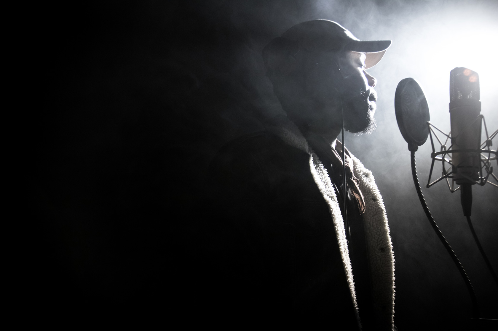

J-Vern is an up-and-coming artist born in La Plata, Maryland. Introduced by his grandfather to the musical arts at a young age and later to music production by his older brother, Vern developed a passion for composing music. His unique lyrical creations have been heavily influenced and inspired by his life abroad, as he was raised in different countries such as Mexico, England and Taiwan. Currently living in Shanghai China, J-Vern is working on his first Mixtape featuring members of his label Blancc State.

Blancc State Label was founded by J-Vern and long time friend and producer MMHHMM a.k.a dirtynotsoclean. The idea behind Blancc State is to offer any artist the opportunity to strive and practice what they love. With a strong, solid and reliable brand, J-Vern hopes to unify and bring together artists from around the world to perform and record new songs and accomplish their dream.

I put a lot of time and thought into each word I place when writing a song, making my audience feel what I feel, and  expressing my thoughts through a myriad of energy for each stage I touch. I have spent almost my entire life  overseas where I have been able to craft together my individuality while also keeping up with modern music trends with my sights on creating new ones.”

- J-Vern.
